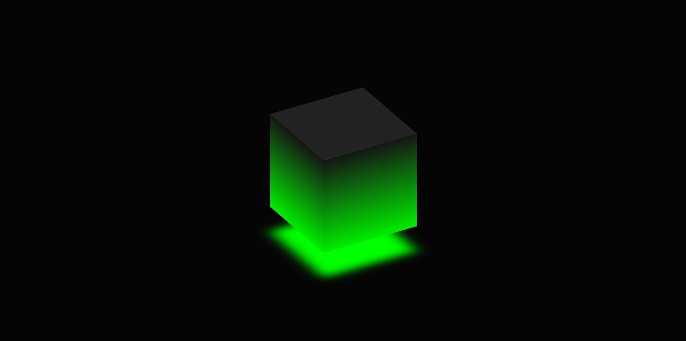

# Glowing Cube



## Table of Contents  
* [Description](##Description)  

* [Installation](##Installation)  
* [License](##License)  
* [Contact](##Contact)  

## Description
This web apllicaiton is a demonstration of css different css properties. The css properties are used to create a glowing rotating cube.

### Future Development

This application will eventually have multiple glowing cubes abd be deployed to a website.

### Installation
1. Clone the repo
   ``sh
   git clone https://github.com/hoeferg/glowingcube
   ```
2. Install NPM packages
   ```sh
   npm install
   ```
3. Start the application
   ```sh
   npm start


## License

No license

---

## Contact
Gayle Hoefer - [LinkedIn](https://www.linkedin.com/in/gayle-hoefer-61a2a3124/) - [Github](https://github.com/hoeferg)
